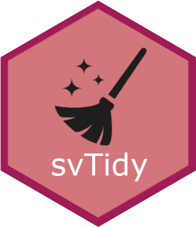

<!-- README.md is generated from README.Rmd. Please edit that file -->

# ‘SciViews::R’ - Tidy Functions <a href="https://www.sciviews.org/svTidy"></a>

<!-- badges: start -->

[](https://github.com/SciViews/svTidy/actions/workflows/R-CMD-check.yaml)
[](https://app.codecov.io/gh/SciViews/svTidy)
[](https://CRAN.R-project.org/package=svTidy)
[](https://sciviews.r-universe.dev/svTidy)
[](https://opensource.org/licenses/MIT)
[](https://lifecycle.r-lib.org/articles/stages.html#experimental)
<!-- badges: end -->

SciViews equivalent functions of ‘dplyr’ and ‘tidyr’, but faster and
using a standard evaluation of arguments or formulas.

## Installation

You can install the development version of {svTidy} from
[GitHub](https://github.com/) with:

``` r
# install.packages("pak")
pak::pak("SciViews/svTidy")
```

## Example

This is a basic example which shows you how to solve a common problem:

``` r
library(svTidy)
#> Registered S3 method overwritten by 'svTidy':
#>   method           from  
#>   print.grouped_df svBase
## basic example code
```

For further instructions, please, refer to the help pages at
<https://www.sciviews.org/svTidy/>.

## Code of Conduct

Please note that the {svTidy} package is released with a [Contributor
Code of
Conduct](https://contributor-covenant.org/version/2/1/CODE_OF_CONDUCT.html).
By contributing to this project, you agree to abide by its terms.
